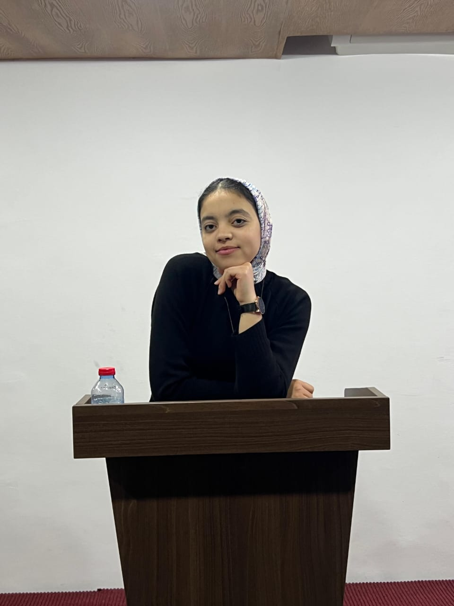

  <h1>Douaa Hasnaoui</h1>
  

  
<em>Aspiring Data Scientist | Passionate about Machine Learning, AI & Data-Driven Solutions</em>

---

## About Me

I am a third-year computer systems engineering student specializing in Data Science.  
I enjoy exploring data to extract meaningful insights and building predictive models using Python, machine learning, and statistics.  
I am eager to apply my skills to solve real-world problems and contribute to innovative projects.

---

## Projects

### Spam and Ham Detector  
- Developed a spam and ham message detector using Natural Language Processing (NLP) techniques.  
- Built a dashboard to visualize the classification results and model performance.

### Social Media Influence Dashboard  
- Created a dashboard to study the influence of social media on consumer purchasing decisions.  
- Analyzed data and visualized key trends to support marketing strategies.

### Employee Salary Prediction Model  
- Developed a predictive model to estimate employee salaries across different provinces using machine learning.  

### Power BI Dashboards for Company Visits  
- Created interactive Power BI dashboards to visualize the site visit logs for the company Autops, enabling better tracking and analysis of visitor behavior.

---

## Contact

- Email: douaa.hasnaoui@example.com  
- LinkedIn: [linkedin.com/in/douaa-hasnaoui](https://www.linkedin.com/in/douaa-hasnaoui)

---

  <a href="#readme-top">Back to top</a>

